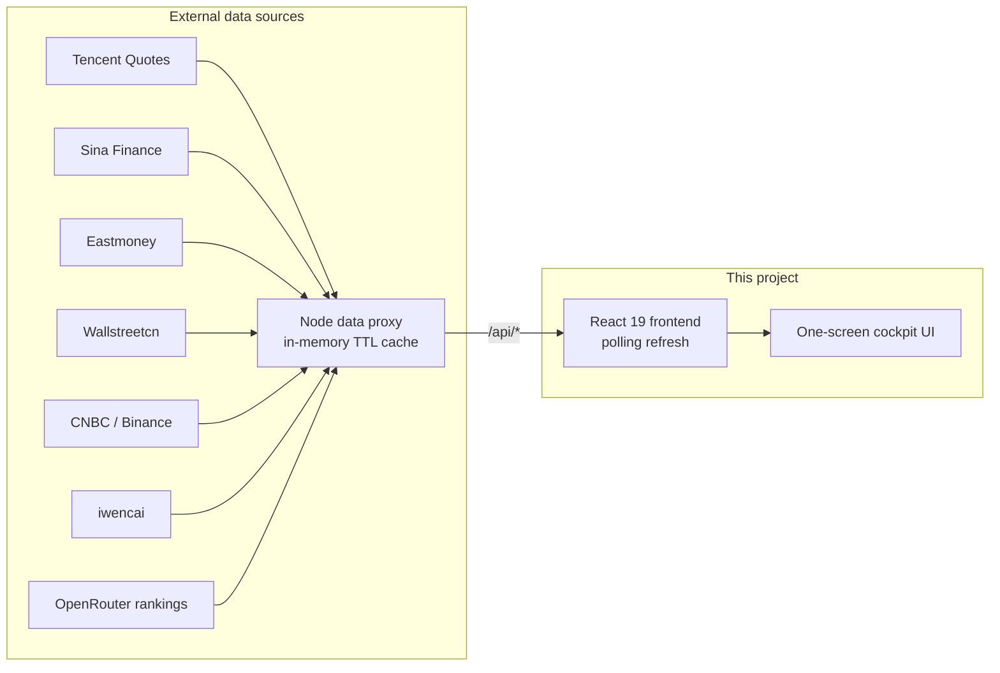

<div align="center">


# 📊 Market Research Cockpit

**A one-screen real-time market dashboard for financial & industry research**

A-shares / HK / US stocks · Commodities · US Treasury yields · Sector heat · Money flow · 7×24 news flash · Industry-chain watchlists

[简体中文](README.md)

[](https://react.dev)
[](https://vite.dev)
[](https://www.typescriptlang.org)
[](https://tailwindcss.com)
[](https://nodejs.org)
[](LICENSE)

</div>


## ✨ Features

- **🌍 Global markets on one screen** — SSE / SZSE / Hang Seng / Dow / Nasdaq / S&P 500 / VIX / USD-CNY, with minute-level index charts side by side
- **🥇 Commodities & crypto** — NY gold/silver, London gold, SHFE gold, LME copper, crude oil, BTC — live prices with intraday curves
- **💵 US Treasury monitor** — 10Y / 2Y yields, 2s10s spread, yield-curve shape and its month-by-month history back to 2001
- **🔥 Sector heat radar** — Industry / concept sector rankings; click a sector to drill into constituents, leading stocks and money flow
- **💰 Money-flow tracking** — Top stocks by main-force net inflow, minute-level cumulative sector flow curves, hot / top-gainer / top-loser lists
- **⛓️ Industry-chain panorama** — Semiconductors, AI compute, EV, robotics, innovative drugs and more; upstream/midstream/downstream tickers linked to live quotes. Stock lists can be edited manually or fetched automatically from iwencai
- **🤖 AI cockpit** — OpenRouter daily rankings API tracking token-consumption trends of 50+ global LLM providers (7d–1y ranges), stacked-area share charts by provider/country/region, 60+ day long-range history
- **🏷️ Commodity prices page (/goods)** — Main-contract futures daily trends across 6 groups (precious / base / ferrous / energy-chem / agri / international energy) with 30d–365d ranges, plus Sunsirs spot quotes (accumulated daily) and spot–futures basis tables
- **📰 7×24 news flash** — Scrolling global financial news with auto-highlighted macro keywords and industry-chain mentions
- **🖥️ Installable desktop app** — Built-in PWA support (Web Manifest + Service Worker); install from the browser address bar and run in a standalone window
- **⚡ Zero-dependency data service** — Built-in Node proxy aggregates public market-data endpoints with in-memory caching; most endpoints need no API key and work out of the box

## 🏗️ Architecture



- The frontend prefers the bundled Node proxy; when it is unavailable, some endpoints (Tencent / Wallstreetcn) gracefully fall back to direct browser connections
- **Unified client quote hub**: all panel prices / changes come from a single client-side quote hub (`src/lib/market.ts`) that batch-fetches every 5s and distributes one snapshot — the same ticker renders the same frame everywhere; server-side quotes are cached per code (1.5s) and watch-set changes only fetch the new codes
- Per-endpoint server cache TTLs (1.5s for quotes up to 24h for sector membership), bounded capacity (LRU + periodic sweep), no database, no external storage
- Spot prices are collected by the server every 4 hours into local history files — history grows day by day without the frontend being online
- Single-process production: one port serves both the API and the built frontend

## 🚀 Quick start

### Prerequisites

- Node.js 18+
- `curl` available on the system (used by some proxy endpoints)

### Local development

```bash
npm install     # or pnpm install
npm run dev
```

- Frontend dev server: <http://localhost:3000>
- Data proxy: <http://localhost:3001> (Vite proxies `/api` to it automatically)

### Production

```bash
npm run build   # builds to dist/
# Optional: configure an OpenRouter API key (AI cockpit panel)
# echo 'OPENROUTER_API_KEY=sk-or-v1-xxxx' > server/.env
npm start       # single process, visit http://localhost:3000
```

### Docker

```bash
docker build -t market-cockpit .
docker run -p 3000:3000 market-cockpit
```

### Install as a desktop app (PWA)

Open the deployed page in Chrome / Edge and click the **install icon** on the right of the address bar (or menu → "Install Market Research Cockpit") to run it as a standalone desktop app with offline-cached static assets and its own icon.

> Note: market data is fetched live; offline only the app shell works.

## 📡 API overview

During development the frontend talks to the local proxy via `/api`:

| Endpoint | Description |
| --- | --- |
| `/api/quotes?codes=...` | Real-time index / stock quotes |
| `/api/minute?code=...` | Intraday minute series |
| `/api/boards?type=...&dir=...&n=...` | Industry / concept sector rankings |
| `/api/board-stocks?code=...&n=...` | Sector constituents |
| `/api/futures?list=...` | Commodity / crypto quotes |
| `/api/future-minute?code=...` | Futures intraday series |
| `/api/future-daily?code=...&n=...` | Futures daily K-line (last ~400 bars; domestic `nf_` / international `hf_`) |
| `/api/spot-table` | Sunsirs spot–futures table (spot / futures / basis; spot history accumulates daily) |
| `/api/chem-spot?id=...&name=...` | Sunsirs chemical spot quotes (median market price, history accumulates daily) |
| `/api/rank?sort=...&n=...` | Stock leaderboards (gain / turnover / volume) |
| `/api/moneyflow?n=...` | Top stocks by main-force net inflow |
| `/api/stock-flows?codes=...` | Batch per-stock money flow |
| `/api/board-flow?n=...` | Sector money-flow curves |
| `/api/stock-boards?code=...` | Sectors a stock belongs to (industry / region / concept) |
| `/api/news?page=...&size=...` | 7×24 financial news flash |
| `/api/treasuries` | Real-time US Treasury yields |
| `/api/treasury-history` | Monthly US Treasury yield history (2001–now; local archive in `server/treasury-rates/` + live fill for the current year) |
| `/api/mystery-select?query=...&limit=...` | iwencai stock screening (by concept / industry) |
| `/api/chain-parse` | Industry-chain text parsing (auto-assigns upstream / midstream / downstream by paragraph headings) |
| `/api/openrouter-usage` | OpenRouter daily rankings (provider token consumption, persisted local cache) |
| `/api/stock-search?q=...` | Stock search (name / pinyin initials → code, Sina suggestion proxy) |
| `/api/health` | Health check |

> Note: `/api/mystery-select` and `/api/openrouter-usage` consume server-side private API keys and only accept same-origin page requests (403 cross-origin). All APIs only reflect CORS Origin to same-origin pages and are rate-limited per client IP (240 req/min public, 20 req/min private; 429 when exceeded; real client IP taken from `CF-Connecting-IP` behind Cloudflare Tunnel). POST bodies are capped at 256KB, and unmatched `/api/` routes return a 404 JSON.

## 🗂️ Project structure

```
├── server/
│   ├── dev.cjs        # Dev entry: starts Vite and the data proxy together
│   └── index.cjs      # Data proxy + production static file serving
├── src/
│   ├── App.tsx        # Cockpit layout & routing (/ market cockpit, /ai AI cockpit, /goods commodity prices)
│   ├── AiDashboard.tsx    # AI cockpit page
│   ├── GoodsDashboard.tsx # Commodity prices page (6-group trend panels + spot/basis panel)
│   ├── components/
│   │   └── dash/      # Cockpit panels (indices / sectors / money flow / news / industry chains / AI cockpit / watchlist / commodity trends…)
│   │       ├── Spark.tsx       # Mini sparklines (A-share session axis / 24h continuous axis / evenly-spaced daily)
│   │       └── WatchlistPanel.tsx  # Watchlist panel (name/pinyin search, localStorage persistence)
│   ├── config/        # Static config for indices, commodities, industry chains
│   ├── hooks/         # usePolling / useSharedPolling / useClock and other shared hooks
│   └── lib/           # API client, unified quote hub (market.ts) and utilities
└── docs/              # Screenshots and other doc assets
```

## 🛠️ Tech stack

- **Frontend**: React 19 · Vite 7 · TypeScript · Tailwind CSS · lucide-react icons (charts are hand-written SVG)
- **Backend**: Node.js native `http` (no framework) · `curl` / `fetch`
- **Data sources**: Tencent, Sina, Eastmoney, Wallstreetcn, CNBC, Binance, Sunsirs and other public market-data endpoints

## ⚠️ Disclaimer

This project is for learning and research purposes only. All market data comes from public web endpoints and may be delayed or inaccurate. Nothing here constitutes investment advice.

## 🤝 Contributing

Issues and PRs are welcome:

1. Fork this repository
2. Create a `feature/xxx` branch
3. Commit and push your changes
4. Open a Pull Request

## 📄 License

## Star History

<a href="https://www.star-history.com/?repos=theBigGavin%2Fmarketingdashboard&type=date&legend=top-left">
 <picture>
   <source media="(prefers-color-scheme: dark)" srcset="https://api.star-history.com/chart?repos=theBigGavin/marketingdashboard&type=date&theme=dark&legend=top-left&sealed_token=dBzGp13q5WXRY2nMzJx6pYXb47s2aeyPcdT5LjDYHCmoQuFJjufDDhjF2laPizeEk14vFH6zTsh5r70wFDMc3_rnNmoEvWRadKI0-D-R4aY9EYZUJhSB4fyhjvQvzCQfFUEGZFypsiwhBAbcfBriRgP5_e1vogjMSMnUJyAoHdSVcLcrOMXpQCDOKL_a" />
   <source media="(prefers-color-scheme: light)" srcset="https://api.star-history.com/chart?repos=theBigGavin/marketingdashboard&type=date&legend=top-left&sealed_token=dBzGp13q5WXRY2nMzJx6pYXb47s2aeyPcdT5LjDYHCmoQuFJjufDDhjF2laPizeEk14vFH6zTsh5r70wFDMc3_rnNmoEvWRadKI0-D-R4aY9EYZUJhSB4fyhjvQvzCQfFUEGZFypsiwhBAbcfBriRgP5_e1vogjMSMnUJyAoHdSVcLcrOMXpQCDOKL_a" />
   
 </picture>
</a>

[MIT](LICENSE)
